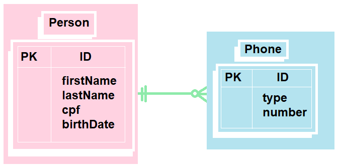

<h1 align="center">
    <a href="https://github.com/Fernanda1701/dioperson-api">Sistema de gerenciamento de pessoas 📑</a>
</h1>
<p align="center">Em API REST com Spring Boot</p>

<h2 align="center">

</h2>


## 💎 Sobre

O projeto foi desenvolvido para efetuar operações de gerenciamento de usuários, tais como:
- [x] Cadastro
- [x] Leitura 
- [x] Atualização  
- [x] Remoção 
<p>de pessoas em um sistema.</p> 
<p>Como estrutura de Dados, foi determinado que o cadastro de pessoas deveria preencher os seguintes parâmetros:</p>

- First Name
- Last Name
- CPF
- Birth Date
- Phone seguido pelo Type e Number

<p>Abaixo temos uma tabela de modelo de Dados demonstrando o comportamento dos dados no Banco:</p>


<h3 align="center">Tabela: Modelo de Dados</h3>

<p align="center">
  
</p>


<p>Como podemos observar a Tabela Phone está atrelada à Tabela Person por uma chave estrangeira.</p>
<p>Passado os parâmetros e finalizada a conexão com o Banco de dados H2, foi feita a implementação de testes unitários para a validação das funcionalidades, 
com isso o projeto ficou acessível para uso, disponível no Github e implementado no sistema cloud através do Heroku.</p>


## ⚙️ Execução

- Para executar o projeto no IntelliJ, basta pressionar "<b>Run</b>" na própria IDE. 
- Para executar o projeto no terminal, digite o seguinte comando:

```bash
mvn spring-boot:run
```
- Após executar o comando acima, abra o seguinte endereço para visualizar a execução do projeto:
```bash
http://localhost:8080/api/v1/people
```
- Para executar na cloud utilize o seguinte endereço:
```bash
https://dioperson-api.herokuapp.com/api/v1/people
```
- Para fazer cadastro, leitura, atualização e remoção de pessoas, utilize a plataforma Postman, ou outra de sua preferência com os endereços acima, tanto o LocalHost quanto o Cloud. 

## 🛠 Tecnologias
 
- Aplicação inicializada com [Spring Initializr](https://start.spring.io/)
- [Java](https://www.java.com/) 11
- [Maven](https://maven.apache.org/) 4.0.0
- [Spring Boot](https://spring.io/projects/spring-boot) 2.2.6.RELEASE
- Versionamento de código no [Git](https://git-scm.com/)
- [H2 Database](https://www.h2database.com/html/main.html)

### Dependências:

- [Spring Data JPA](https://spring.io/projects/spring-data-jpa)
- [Spring Web](https://docs.spring.io/spring-framework/docs/current/reference/html/web.html#spring-web)
- [Spring DevTools](https://docs.spring.io/spring-boot/docs/1.5.16.RELEASE/reference/html/using-boot-devtools.html)
- [Spring Test](https://docs.spring.io/spring-framework/docs/current/reference/html/testing.html)
- [Lombok](https://projectlombok.org/)
- [Mapstruct](https://mapstruct.org/) 1.3.1.Final
- [Junit Vintage Engine](https://mvnrepository.com/artifact/org.junit.vintage/junit-vintage-engine)

## 💻 IDE

IDE utilizada: [IntelliJ](https://www.jetbrains.com/pt-br/idea/)

## ☁️ Cloud

Cloud utilizada: [Heroku](https://id.heroku.com/)

## Autor:

<a href="https://github.com/Fernanda1701">
 
 <br />
 <sub><b>Fernanda Nascimento</b></sub></a> <a href="https://github.com/Fernanda1701"></a>

Entre em contato ✉️:

[](https://www.linkedin.com/in/fnasci/)
[](mailto:fnasci.1701@gmail.com)
